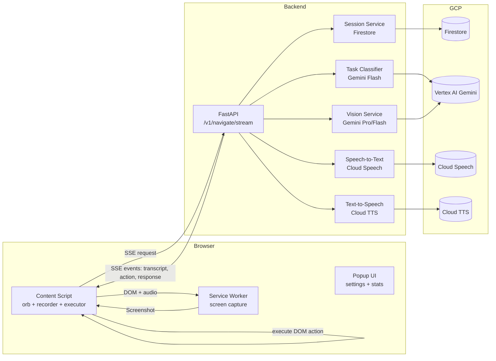
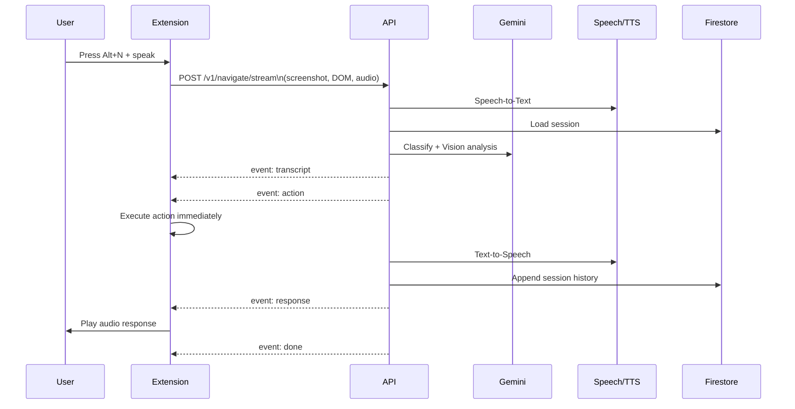

# UI Navigator - AI Screen Reader

UI Navigator is a Chrome extension plus a FastAPI backend that helps blind and low-vision users navigate any website using voice. The extension captures the current screen and a structured DOM snapshot, sends it to the backend, and receives a spoken response plus an actionable UI command to execute on the page.

**Status:** Hackathon prototype with a working end-to-end flow.

## What It Does

- Voice-activated navigation with `Alt+N` and on-page orb UI.
- Multilingual speech-to-text and text-to-speech responses.
- Visual + DOM understanding via Gemini to generate actionable UI steps.
- Streaming responses over SSE for low-latency action execution.
- Session memory and language preference tracking in Firestore.

## Demo

Video: https://www.youtube.com/watch?v=VHHHjYL7Gzw

## Architecture

**Core idea:** combine a screenshot + DOM snapshot with the user's voice query, let Gemini plan the action, then execute it directly in the browser while speaking back the result.

**Components**

- Chrome Extension (MV3)
- FastAPI backend (`Backend/`)
- Vertex AI Gemini (vision + text)
- Google Cloud Speech-to-Text and Text-to-Speech
- Firestore (session history and preferences)

## Technical Diagram



## Request Flow (SSE)



## Project Structure

- `Backend/` FastAPI server, Gemini calls, STT/TTS, Firestore sessions.
- `Frontend/` Chrome extension (content scripts, background worker, popup UI).
- `infrastructure/` Cloud Build config and Terraform placeholders.

## Local Setup

### Backend

1. Create a `.env` file in `Backend/` (see `Backend/.env` for an example).
2. Ensure `GOOGLE_APPLICATION_CREDENTIALS` points to a service account JSON with:
   `Vertex AI`, `Speech`, `Text-to-Speech`, and `Firestore` access.
3. Install and run:

```bash
cd Backend
python -m venv .venv
. .venv/bin/activate  # Windows: .venv\Scripts\activate
pip install -r requirements.txt
uvicorn main:app --reload --port 8000
```

The API will be available at `http://localhost:8000`.

### Frontend (Chrome Extension)

1. Update API base in `Frontend/background/sw.js` if needed.
2. In Chrome, open `chrome://extensions` and enable Developer Mode.
3. Click "Load unpacked" and select the `Frontend/` directory.
4. Press `Alt+N` on any page to activate.

## Configuration

Backend configuration is managed via environment variables in `Backend/.env`:

- `GCP_PROJECT_ID`
- `GCP_REGION`
- `VERTEX_REGION`
- `GEMINI_MODEL_PRO`
- `GEMINI_MODEL_FLASH`
- `FIREBASE_PROJECT_ID`
- `RATE_LIMIT_RPM`
- `MAX_SCREENSHOT_KB`
- `MAX_AUDIO_SEC`
- `ENVIRONMENT`
- `GOOGLE_APPLICATION_CREDENTIALS`

## API Endpoints

- `POST /v1/navigate/stream` Streaming SSE events for transcript, action, response.
- `GET /v1/session/{session_id}` Session summary for popup stats.
- `DELETE /v1/session/{session_id}` Clear session history.
- `GET /v1/session/{session_id}/history` Full session history.
- `GET /health` Health check.

## Deployment

Cloud Build configuration is in `infrastructure/cloudbuild.yaml`.
It builds the backend Docker image and deploys to Cloud Run.

## Notes

- The extension executes actions immediately on receipt to reduce perceived latency.
- If TTS playback fails, Chrome's built-in `tts` API is used as a fallback.
- DOM snapshots are limited to visible interactive elements for model efficiency.

